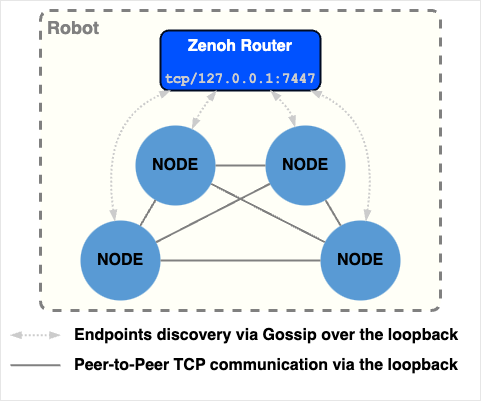
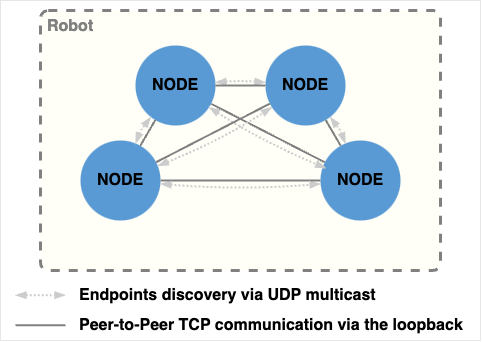

<!--
   Note to all contributors to this documentation:
   All the images have been created using draw.io desktop.
       https://github.com/jgraph/drawio-desktop
   Each PNG file contains the diagram description and can be open with draw.io desktop
   or directly on https://app.diagrams.net/ to be modified.
-->

# Configuration

## Configuration files

Zenoh can be configured via a configuration file. Its syntax is usually in JSON5, but JSON and YAML are also supported.  
Each ROS Node can configure its **Zenoh Session** using a file, with the file path specified by the `ZENOH_SESSION_CONFIG_URI` environment variable. Note that a composition of Nodes within a single process will share the same Zenoh Session and thus the same configuration.  
Similarly, a **Zenoh Router** can be configured using a file, with the file path specified by the `ZENOH_ROUTER_CONFIG_URI` environment variable.

The table below summarizes those environment variables, and the default configuration file that apply if each is not defined:

|         |   Envar for custom config  |                                            Default config                                             |
|---------|:--------------------------:|:-----------------------------------------------------------------------------------------------------:|
| Router  | `ZENOH_ROUTER_CONFIG_URI`  | [DEFAULT_RMW_ZENOH_ROUTER_CONFIG.json5](/rmw_zenoh_cpp/config/DEFAULT_RMW_ZENOH_ROUTER_CONFIG.json5)   |
| Session | `ZENOH_SESSION_CONFIG_URI` | [DEFAULT_RMW_ZENOH_SESSION_CONFIG.json5](/rmw_zenoh_cpp/config/DEFAULT_RMW_ZENOH_SESSION_CONFIG.json5) |

## Default configuration

With the default configuration, the `Zenoh Router` needs to be running on the host. Upon startup, each ROS Node connects to this local router. The router operates a _"Gossip Scouting Protocol"_ that forwards each Node's locators (IP + port number) to all other Nodes, enabling them to automatically connect to one another.

<p align="center"></p>

The router opens the TCP port `7447` on all available network interfaces. Each Node connect to the local router on locator: `tcp/127.0.0.1:7447`.  
Each Node opens a random TCP port only on the loopback interface (`127.0.0.1`). Hence all the peer-to-peer communications between Nodes occurs via the loopback interface.

> [!NOTE]
>
> **_Why this choice of configuration by default ?_**
>
> This configuration works out-of-the-box in the vaste majority of platforms, without requiring any network configuration. UDP multicast is not used, and thus doesn't need to be configured. All connections between Nodes are peer-to-peer via TCP over the loopback, allowing reliable and low latency communications without any network configuration.
>
> The usage of a Zenoh Router also has other benefits for communications with another hosts:
>
> - Less TCP connections and thus less network overhead
> - Zenoh performs automatic batching of small messages within a same connection, thus improving the throughput
> - Smaller surface of attack, since only 1 TCP port is open, and can be configured to use mTLS
> - The router can be configured to perform Downsampling and Access Control on external communications
>
> Those features will be detailled in the following sections.

> [!NOTE]
>
> **_What if the router crashes ?_**
>
> The Nodes will continue to communicate with each other without any error. The router can be re-started and the Nodes will automatically re-connect to the router.
>
> During a router outage, no new Nodes, including the `ros2` CLI tool, can join the system. Consequently, the tool may not function correctly, although its introspection commands might still respond if the ROS daemon was active before the router went down. However, the daemon's view of the ROS graph will not be up-to-date.

## Case of a robot with multiple hosts

_TBC_

## Connection from/to another host

_TBC_

## Direct connection of a remote Node

_TBC_

## Automatic discovery and interconnections of Zenoh routers

_TBC_

## Remote connection via a Zenoh router in the cloud

_TBC_

## No router, UDP multicast scouting, single host

Running a Zenoh Router is not mandatory. The ROS Nodes can discovery and automatically connect to each other via the Zenoh UDP multicast scouting.

<p align="center"></p>

To achieve this you need to:

  1. Make sure that your host's network is configured to support UDP multicast over the loopback.

  2. Copy and update the [DEFAULT_RMW_ZENOH_SESSION_CONFIG.json5](/rmw_zenoh_cpp/config/DEFAULT_RMW_ZENOH_SESSION_CONFIG.json5) file changing only those settings:

        ```json5
        scouting: {
            multicast: {
                enabled: true,
                interface: "lo",
            },
        }
        ```

  3. Run each of your Node with the `$ZENOH_SESSION_CONFIG_URI` environment variable pointing to this updated file.

> [!NOTE]
>
> Here the interface for multicast scouting is configured to `"lo"` (loopback) to avoid sending discovery information to other hosts,
> and to avoid discovering and connecting to Nodes running on other hosts. See the next section for discovery and connection across multiple hosts.

## No router, UDP multicast scouting, multiple hosts

_TBC_

## Downsampling

_TBC_

## ACL

_TBC_
